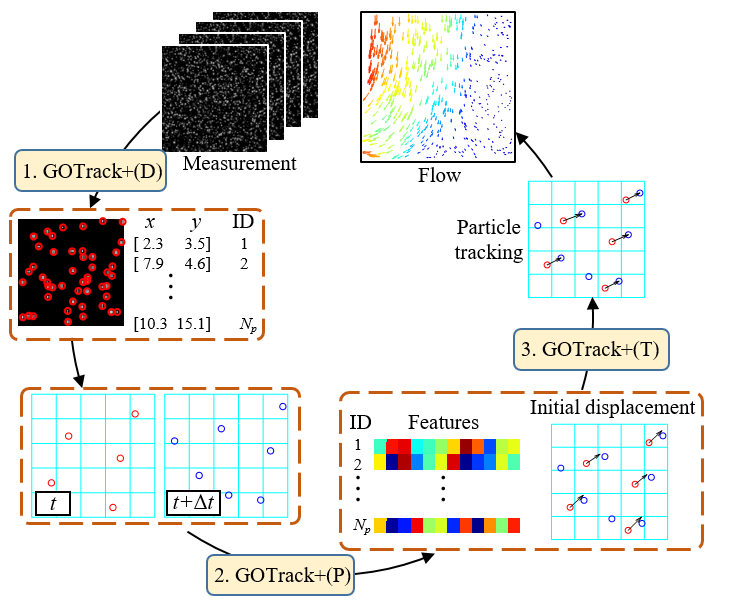
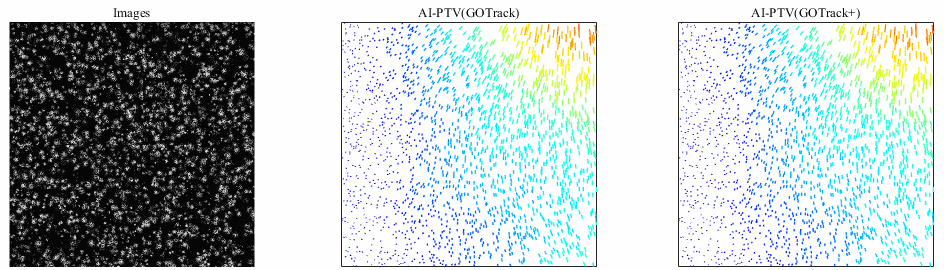

## GOTrack+: A Deep Learning Framework with Graph Optimal Transport for Particle Tracking Velocimetry



## Overview
This is the official PyTorch implementation of "GOTrack+: A Deep Learning Framework with Graph Optimal Transport for Particle Tracking Velocimetry". 
PTV is a key approach in experimental fluid dynamics and of fundamental importance in diverse applications, including automotive, aerospace, and biomedical engineering.
In this work, we propose an AI-enhanced systematic PTV framework GOTrack+ to track particle trajectories from consecutive images. 
GOTrack+ contains three components: 
a convolutional neural network-based particle detector for particle recognition and sub-pixel coordinate localization; 
a graph neural network-based initial displacement predictor for fluid motion estimation; 
and an optimal transport-based particle tracker for continuous particle trajectory linking.
Each component of GOTrack+ can be extracted and used independently, not only to enhance classical PTV algorithms but also as a simple, fast, accurate, and stable alternative to traditional PTV projects.


The GNN displacement predictor is constructed in the [GOTFlow3D](https://doi.org/10.1038/s42256-023-00648-y) framework, which is the state-of-the-art model designed for 3D complex flow motion estimation.


## Requirements
The code has been tested with Python 3.8, PyTorch 1.10 and Cuda 11.3.
```Shell
conda install pytorch==1.10.1 torchvision==0.11.2 torchaudio==0.10.1 cudatoolkit=11.3 -c pytorch -c conda-forge
conda install tqdm tensorboard scipy imageio
conda install numpy==1.23.5
conda install matplotlib==3.7.2
pip install torch-scatter==2.0.9 -f https://pytorch-geometric.com/whl/torch-1.10.1+cu113.html
```
You also need to install [KNN_CUDA](https://github.com/unlimblue/KNN_CUDA.git)

## Pretrained models
Pretrained models can be found in `./precomputed_ckpts/`. Several pretrained models are available:
* CNN_detector: CNN detector for pixel-level localization of particles
* CNN_locator: CNN locator for particle sub-pixel coordinate localization
* GNN_dis_predictor: GNN predictor for particle feature extraction and initial displacement prediction

## Required Data
To train CNN, you will need to download the required datasets. Minimal training and validation dataset can be found in `./data/particle_image/`. 
* [Particle image](https://github.com/wuwuwuas/Data_particle_detection.git)

To train GNN, you will need to download the required datasets. Minimal training and validation dataset can be found in `./data/PTVflow2D/`. 
* [PTVflow2D](https://github.com/JiamingSkGrey/PTV_dataset)


Several synthetic and experimental measurement test cases are provided:
* Test data for particle localization with sub-pixel ('particle_image')
* Test data for particle displacement prediction ('PTVflow2D')
* Standard synthetic shear jet flow ('VSJ 301'). This is a series of PIV images for transient 3D flow field with slit light sheet, and you can download it from [VSJ 301](http://www.vsj.jp/~pivstd/image3d/image-e.html).

## Tracking Particle Trajectories from Consecutive Particle Images with GOTrack+

This is a case of using GOTrack+ to test the VSJ301 data set.

```Shell
python test_AI_PTV.py  --gpu 0 --data_path ./data/vsj301/ --img_type bmp --name vsj301 --tracking_mode GOTrack+ --result_plot 1 --delta_t 1 --illumination 0.9 --scale_image 1 --nb_iter 30 --candidates 8 --iters 12 --neighbor_similarity 7 --threshold_similarity 4 --neighbor_outlier 8 --threshold_outlier 2
```
This is the example result in the case of 'VSJ 301', from left to right are the original images, the tracking trajectories of GOTrack and GOTrack+ respectively.



You can put your own images under `data` and use GOTrack+ to estimate flow motion.

## Evaluation for GOTrack+'s sub-modules

To evaluate a pretrained particle detection model use `evaluate_CNN.py`. The following command shows an example:
```Shell
python evaluate_CNN.py  --gpu 0 --name Particle_detection --detector_path ./precomputed_ckpts/CNN_detector/ckpt.tar --locator_path ./precomputed_ckpts/CNN_locator/ckpt.tar --data_path ./data/particle_image/ --output_dir_ckpt ./result/ --result_plot 0 --save 0
```
To evaluate a pretrained particle displacement prediction model use `evaluate_GNN.py`. The following command shows an example:
```Shell
python evaluate_GNN.py --gpus 0 --dataset PTVflow2D --weights ./precomputed_ckpts/GNN_dis_predictor/best_checkpoint.params --iters 8
```

## Training
You can train a new particle detector from scratch using the following command, which consists of two parts: a CNN for pixel-level localization and a CNN for sub-pixel localization.
```Shell
python train_detector.py --name detector --data_path ./data/particle_image/ --batch_size 100 --epochs 1000 --init_lr 0.001 --reduce_factor 0.5 --patience_level 20
```
```Shell
python train_loactor.py --name locator --data_path ./data/particle_image/ --batch_size 1000 --epochs 1000 --init_lr 0.001 --reduce_factor 0.5 --patience_level 20
```

You can train a new GNN displacement predictor from scratch using the following command. 
```Shell
python train_GNN.py --gpus 0 --dataset PTVflow2D --exp_path train --corr_levels 3 --iters 8 --batch_size 16 --test_batch_size 16 --num_epochs 100
```
